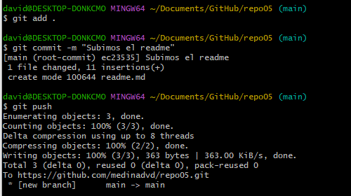
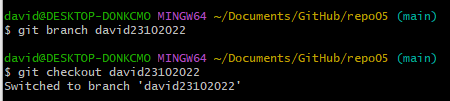

# Git & Markdown

## Ejercicio 4

***

### **5.1**

Para el primer apartado hemos creado el directorio en GitHub y lo hemos clonado en local ya que me parecía la manera más optima.

### **5.2**

Creamos el readme y seguimos los pasos para subirlo al remoto.

### **5.3**

### **5.4**

