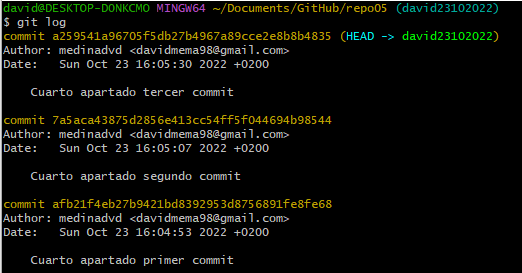
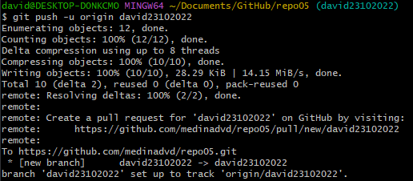
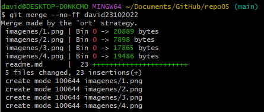
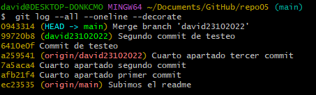
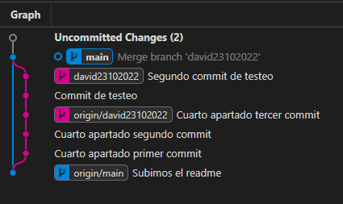

# Git & Markdown

## Ejercicio 4

***

### **5.1**

Para el primer apartado hemos creado el directorio en GitHub y lo hemos clonado en local ya que me parecía la manera más optima.

### **5.2**

Creamos el readme y seguimos los pasos para subirlo al remoto.

### **5.3**

### **5.4**

Despues de realizar los commits, utilizamos el "git log" para verlos reflejados.

### **5.5**

Para subir ramas locales al repositorio remoto utilizamos el comando "git push -u (directorio remoto) (nombre rama)"

### **5.6**

Para fusionar las ramas de manera "no ff", volvemos a la rama "main" y ejecutamos el comando "git merge --no-ff (nombre de la rama).

### **5.7**

Así se ve en el "git log":

Así se ve en el plugin de VSC:

### **5.8**

En esencia ambos metódos de fusión son prácticamente iguales a la hora de implementar cambios de una rama a la otra, la diferencia es que con "no fastforward" podemos ver que rama ha sido la encargada de realizar los commits a la hora de hacer el "git log", lo contrario a la fusión con "fastforward" ya que los commits se unirian en la rama principal.
